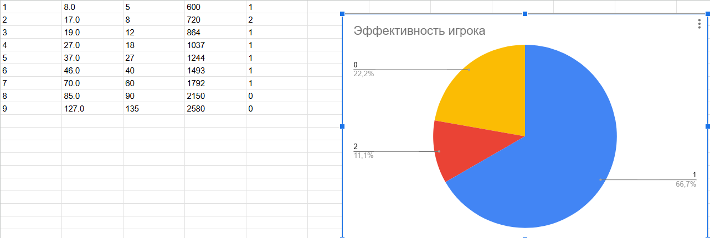

# АНАЛИЗ ДАННЫХ И ИСКУССТВЕННЫЙ ИНТЕЛЛЕКТ [in GameDev]
Отчет по лабораторной работе #2 выполнил(а):
- Чупина Екатерина Алексеевна
- РИ232903

- Отметка о выполнении заданий (заполняется студентом):

| Задание | Выполнение | Баллы |
| ------ | ------ | ------ |
| Задание 1 | * | 60 |
| Задание 2 | * | 20 |
| Задание 3 | * | 20 |

Работу проверили:

[](https://nodesource.com/products/nsolid)

[](https://travis-ci.org/joemccann/dillinger)

Структура отчета


## Цель работы
Научиться передавать в Unity данные из Google Sheets с помощью Python.

## Задание 1
### Выберите одну из игровых переменных в игре, опишите её роль в игре, условия изменения / появления и диапазон допустимых значений. Постройте схему экономической модели в игре и укажите место выбранного ресурса в ней.
Была выбрана [Bloons TD 6](https://store.steampowered.com/app/960090/Bloons_TD_6/)(BTD 6 для краткости) для работы. BTD 6 – игра в жанре Tower Defense, где игроку необходимо защищаться от воздушных шариков – противники – с помощью разнообразных юнитов, представляющие из себя обезьян. Цель игрока – дожить до определённого раунда (определяется уровнем сложности), отбиваясь от усложняющихся волн и противников. Для победы игрок получает __деньги__ с побеждённых врагов .


- Деньги – основной ресурс игрока для размещения и проведения улучшений юнитов, которые использует игрок.
- Для получения денег, как я и написала раньше, нужно уничтожать вражеских юнитов для их получения.


- Можно сказать, что волны и противники являются нашей “трубой” системы.

- Деньги отображаются в виде счётчика - “Инвентарь” системы.


- Деньги “преобразуются” двумя способами – размещение юнита и его улучшение. В соответствии с этим ожидается, что игрок будет лучше справляться с волнами, тем самым получая больше денег.
- В итоге у нас 2 “Преобразователя” – меню юнитов и меню улучшения юнита.


- У юнитов есть опция “Продать”, которая при использовании удаляет юнита с поля и возвращает часть денег, которые были потрачены на него. Мы будем рассматривать этот аспект как “Труба” системы, так как часть денег пропадает в никуда. 


- Деньги являются ключевым аспектом игрового процесса BTD 6.


## Задание 2
### С помощью скрипта на языке Python заполните google-таблицу данными, описывающими выбранную игровую переменную в игре. Средствами google-sheets визуализируйте данные в google-таблице (постройте график / диаграмму и пр.) для наглядного представления выбранной игровой величины. Опишите характер изменения этой величины, опишите недостатки в реализации этой величины (например, в игре может произойти условие наступления эксплойта) и предложите до 3-х вариантов модификации условий работы с переменной, чтобы сделать игровой опыт лучше.

- Скрипт симулирует то, какое решение принимает игрок и насколько она эффективно сказывается на мощь игрока в сравнении с силами противников в каждом раунде. Можно сказать, симулируется 1 матч в игре.

```py

import gspread
import numpy as np
gc = gspread.service_account(filename='stable-reactor-444811-r6-e1e4efabc6c3.json')
sh = gc.open("UnityProject1")
playeDesicion = np.random.randint(30, 200, 10)
mon = list(range(1,10))
upgrades_or_units = 5
moneyRound = 500
effectiveness = 0
difficalty = 5
i = 0
while i <= len(mon):
    i += 1
    if i == 0:
        continue
    else:
        upgrades_or_units += playeDesicion[i]/100*moneyRound//100
        moneyRound = round(moneyRound*1.2)
        if upgrades_or_units//difficalty >= 2:
            effectiveness = 2
        elif upgrades_or_units//difficalty == 1:
            effectiveness = 1
        else:
            effectiveness = 0
        sh.sheet1.update(('A' + str(i)), str(i))
        sh.sheet1.update(('B' + str(i)), str(upgrades_or_units))
        sh.sheet1.update(('C' + str(i)), str(difficalty))
        sh.sheet1.update(('D' + str(i)), str(moneyRound))
        sh.sheet1.update(('E' + str(i)), str(effectiveness))
        print(upgrades_or_units, difficalty, moneyRound, effectiveness)
        difficalty = round(difficalty*1.5)
```
- 2 столбец представляет эквивалент силы игрока, данные от произведённых "преобразований" в юниты и улучшения. 3 столбец - сложность уровня, увелививающийся в 1.5 раза с каждым раундом. 4 столбец - деньги, которые были получены с прошлого раунда, 5 столбец - эффективность игрока (2 - более в два раза, 1 больше 1 и меньше 2, 0 - меньше 1, то есть проигрыш).
- В Google Sheets сделал диаграмму, насколько успешно игрок проходит раунды, за 10 раундов матча в BTD 6, в 1 матче.



- В игре минус в том, что нет чёткого обучения того, как нужно эффективно использовать свои деньги для побед в матчей. Поэтому предлагаю реализовать "мини-миссии", которые обучат начинающих игроков, какие юниты и как использовать их для успешного прохождения.

## Задание 3
###  Настройте на сцене Unity воспроизведение звуковых файлов, описывающих динамику изменения выбранной переменной.

- Настроила в соотвестветвии инструкций, которые были даны в работе, проект будет в форме Google.

## Выводы

Я познакомилась с работой API для передачи данных между разными сервисами и приложениями и работы с нами и ещё научилась анализировать переменные в играх и их значение на игровой процесс.

## Powered by

**BigDigital Team: Denisov | Fadeev | Panov**
  
