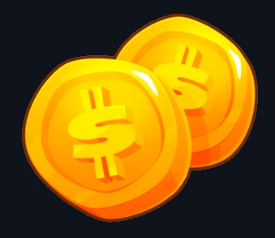
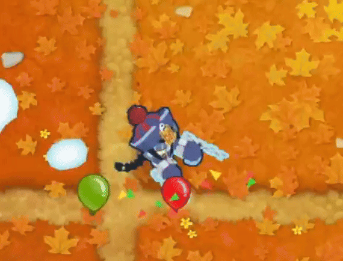
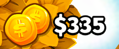
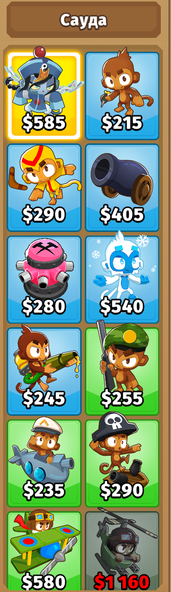
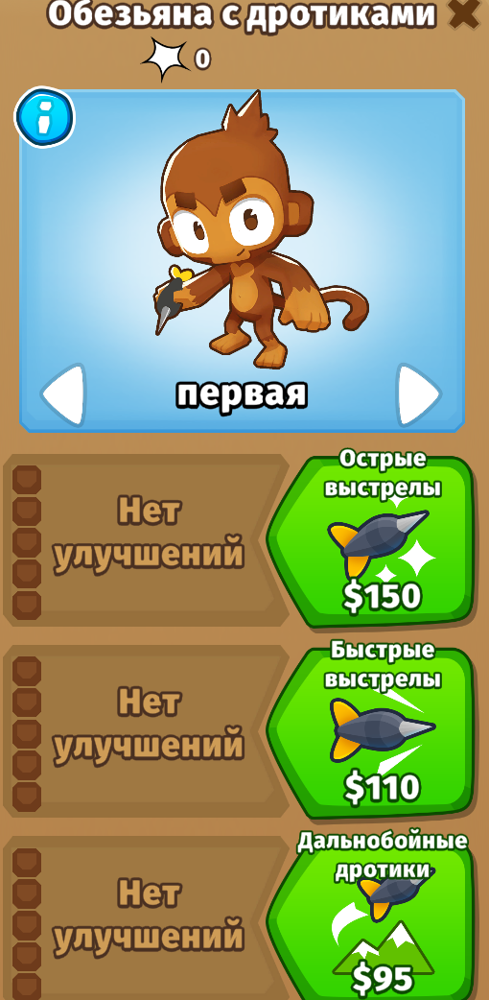
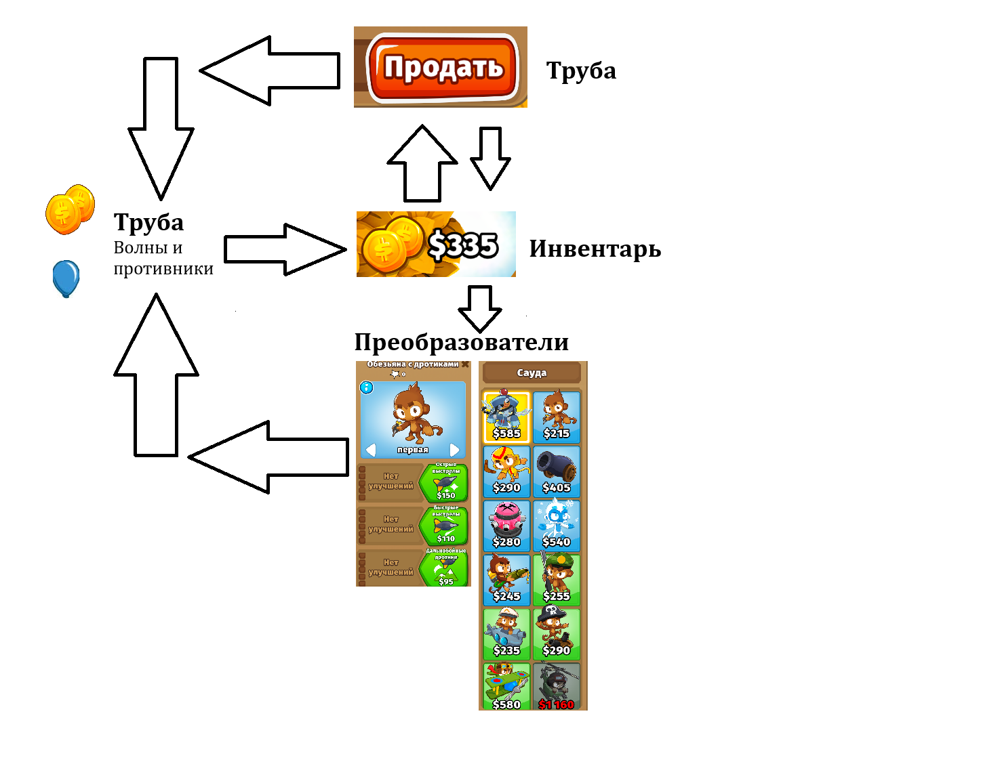

# АНАЛИЗ ДАННЫХ И ИСКУССТВЕННЫЙ ИНТЕЛЛЕКТ [in GameDev]
Отчет по лабораторной работе #2 выполнил(а):
- Чупина Екатерина Алексеевна
- РИ232903

- Отметка о выполнении заданий (заполняется студентом):

| Задание | Выполнение | Баллы |
| ------ | ------ | ------ |
| Задание 1 | * | 60 |
| Задание 2 | * | 20 |
| Задание 3 | * | 20 |

Работу проверили:

Структура отчета

## Цель работы
Научиться передавать в Unity данные из Google Sheets с помощью Python.

## Задание 1
### Выберите одну из игровых переменных в игре, опишите её роль в игре, условия изменения / появления и диапазон допустимых значений. Постройте схему экономической модели в игре и укажите место выбранного ресурса в ней.
Была выбрана [Bloons TD 6](https://store.steampowered.com/app/960090/Bloons_TD_6/)(BTD 6 для краткости) для работы. BTD 6 – игра в жанре Tower Defense, где игроку необходимо защищаться от воздушных шариков – противники – с помощью разнообразных юнитов, представляющие из себя обезьян. Цель игрока – дожить до определённого раунда (определяется уровнем сложности), отбиваясь от усложняющихся волн и противников. Для победы игрок получает __деньги__ с побеждённых врагов .

- Деньги – основной ресурс игрока для размещения и проведения улучшений юнитов, которые использует игрок.
- Для получения денег, как я и написала раньше, нужно уничтожать вражеских юнитов для их получения.

- Можно сказать, что волны и противники являются нашей “трубой” системы.

- Деньги отображаются в виде счётчика - “Инвентарь” системы.

- Деньги “преобразуются” двумя способами – размещение юнита и его улучшение. В соответствии с этим ожидается, что игрок будет лучше справляться с волнами, тем самым получая больше денег.
- В итоге у нас 2 “Преобразователя” – меню юнитов и меню улучшения юнита.

- У юнитов есть опция “Продать”, которая при использовании удаляет юнита с поля и возвращает часть денег, которые были потрачены на него. Мы будем рассматривать этот аспект как “Труба” системы, так как часть денег пропадает в никуда. 

- Деньги являются ключевым аспектом игрового процесса BTD 6.

