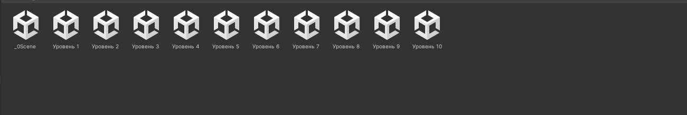

# АНАЛИЗ ДАННЫХ И ИСКУССТВЕННЫЙ ИНТЕЛЛЕКТ [in GameDev]
Отчет по лабораторной работе #3 выполнил(а):
- Чупина Екатерина Алексеевна
- РИ232903

- Отметка о выполнении заданий (заполняется студентом):

| Задание | Выполнение | Баллы |
| ------ | ------ | ------ |
| Задание 1 | * | 60 |
| Задание 2 | * | 20 |
| Задание 3 | - | 20 |

Работу проверили:

## Цель работы
Познакомиться с балансом и как с ней работать.

## Задание 1
### Предложите вариант изменения найденных переменных для 10 уровней в игре. Визуализируйте изменение уровня сложности в таблице.
Я выбрала Dragon Picker для данной работы.
Посмотрев на проект и проверив скрипт, я выделила следующие переменные, влияющие на перемещение дракона: 

- -	Left Right Distance - переменная, опредеяющая, насколько далеко влево и вправо дракон может передвигаться от центра; 	
- - Speed - переменная, отвечающая за скорость перемещения дракона;
- -	Chance Direction - переменная, которая отвечает за то, насколько часто дракон меняет направление.

На сложность сцены в основном влияют две переменные:
- - Time Between Egg Drops - интервал времени, между которыми яйцо выпадает с дракона.
- -	Speed - скорость дракона

- Первая переменная усложняет игру тем, что игроку нужно будет интенсивнее смотреть за падающими яйцами и успевать их ловить. Вторая переменная же усложняет тем, что игроку также нужно следить за перемещением дракона, скорость которого меняется с каждым уровнем.
- Другие переменные в основном вносят вариативность в уровнях.
- Я создала таблицу и выбрала 1, 3, 7, 9 и 10 уровни для сравнения сложности, это приведено в таблице, загруженную в Github в этом папке.

## Задание 2
### Создайте 10 сцен на Unity с изменяющимся уровнем сложности.

- В проекте я сделала 10 уровней, в которых изменяются вышеуказанные переменные для повышения сложности по мере продвижения игрока
 
- Проект будет в unitypackage

## Выводы

Я познакомилась с балансом игр и как работать с ней.

## Powered by

**BigDigital Team: Denisov | Fadeev | Panov**
