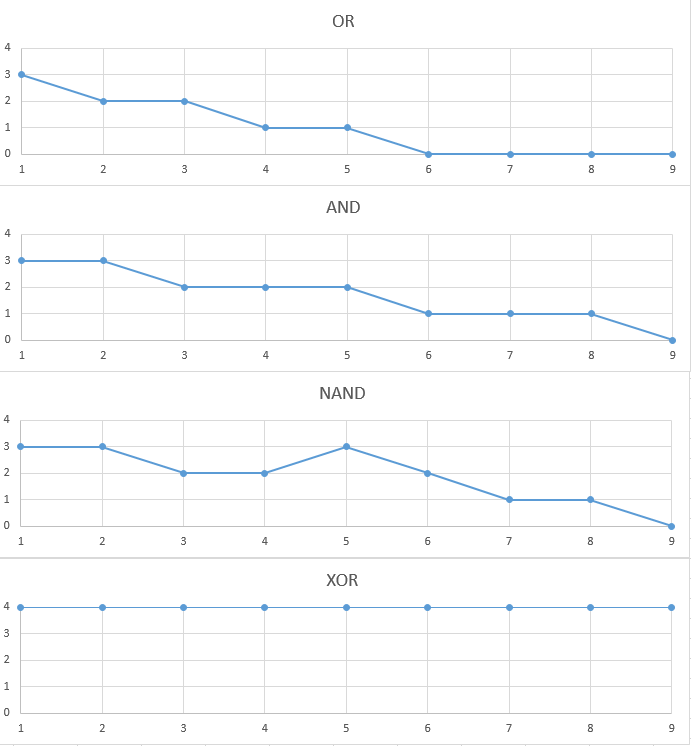

# АНАЛИЗ ДАННЫХ И ИСКУССТВЕННЫЙ ИНТЕЛЛЕКТ [in GameDev]
Отчет по лабораторной работе #4 выполнил(а):
- Чупина Екатерина Алексеевна
- РИ232903

- Отметка о выполнении заданий (заполняется студентом):

| Задание | Выполнение | Баллы |
| ------ | ------ | ------ |
| Задание 1 | * | 60 |
| Задание 2 | * | 20 |
| Задание 3 | * | 20 |

Работу проверили:

## Цель работы
Ознакомится с Percetron в Unity.

## Задание 1
### В проекте Unity реализовать перцептрон, который умеет производить вычисления OR, AND, NAND и XOR. Дать комментарии по их корректности работы.
- Скачала скрипт и создала новый объект с ним, добавив скрипту возможность изменять количество эпох для удобной работы с ним.
- Perceptron c OR выполняется задачу идеально после 4-5 эпох.
- Perceptron с AND выполняется задачу идеально после 8-9. Это обусловлено тем, что операция AND имеет большую сложность, чем OR.
- Perceptron с NAND выполняет задачу идеально также после 8-9, как и AND. Однако я заметила, что на 5-6 больше совершается ошибок, чем по сравнению с AND.
- Perceptron с XOR всегда выдаёт неправильный результат, независимо от количества эпох. XOR является нелинейной функцией, а Perceptron работает по линейной. Он никогда не "поймёт", как правильно совершать операцию XOR.

## Задание 2
### Построить графики зависимости количества эпох от ошибки обучения. Указать от чего зависит необходимое количество эпох обучения.

- Необходимое количество эпох зависит от количества данных и действий, которые нужно совершить Perceptron для выполнения задачи с помощью линейной функции идеалньо. Нужно учитывать, чтобы необходимые данные не были такими, как XOR, иначе Perceptron ничего не сможет сделать.
-  

## Задание 3
###  Построить визуальную модель работы Perceptron на сцене Unity.

- Я поставила 2 куба разного цвета, один из которых падает на другой. Если к моменту завершения всех эпох не останутся ошибки, то когда верхний куб соприкоснётся с нижним, то нижний поменяет цвет, иначе ничего не произойдёт. Это происходит в скрипте Perceptron.

## Выводы

Я познакомилась с Percetron и поняла его принцип работы.

## Powered by

**BigDigital Team: Denisov | Fadeev | Panov**
