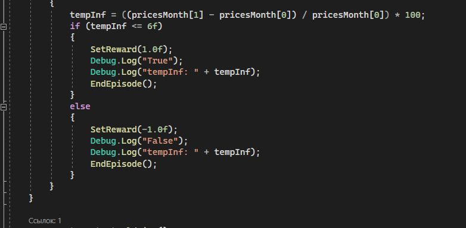

# АНАЛИЗ ДАННЫХ И ИСКУССТВЕННЫЙ ИНТЕЛЛЕКТ [in GameDev]
Отчет по лабораторной работе #5 выполнил(а):
- Чупина Екатерина Алексеевна
- РИ232903
- Отметка о выполнении заданий (заполняется студентом):

| Задание | Выполнение | Баллы |
| ------ | ------ | ------ |
| Задание 1 | * | 60 |
| Задание 2 | * | 20 |
| Задание 3 | * | 20 |

Работу проверили:

## Цель работы
Познакомиться с программными средствами для создания системы машинного обучения и ее интеграции в Unity.

## Задание 1
### Найдите внутри C# скрипта “коэффициент корреляции ” и сделать выводы о том, как он влияет на обучение модели.
- Я ознакомилась с работой ML-Agent и скриптом RolletAgent, выданный в работе. Коэффициент корелляции определяет направление обучения модели и находится в функции OnActionReceived. Он является своебразной "наградой" для нашей модели, определяя правильность действий модели.
- В первом примере корреляция ставится 1 в SetReward(), если агент рядом с целью, иначе награды нет. 

- Во втором примере, коэффициент определяется двумя способами. Если темп инфляции меньше, чем 0.06%, то даётся значение 1, иначе -1.

- Значения 1 и -1 соответственно говорят, правильно или неправльно ли делает агент, что способствует обучению модели.

## Задание 2
### Изменить параметры файла yaml-агента и определить какие параметры и как влияют на обучение модели. Привести описание не менее трех параметров.

- Открыла для изучения Economic.yaml, где изучала и меняла параметры. Дополнительный источником информации была документация по ML-Agents. По наблюдениям в основном на обучение модели влияют категории параметров Hyperparameters и Reward_signals. 
- Я изучила следующие параметры:
- - buffer_size (Hyperparameter) – определяет, сколько опытов нужно собрать перед тем, как обновить модель. Изменяет стабильность обучения модели.
- -	num_epoch (Hyperparameter) – определяет количество эпох, через которые проходит опыт. От этого параметра зависит, насколько стабильно обучение модели и его скорость. Малое количество делает обучение стабильным, но медленным.
- -	epsilon (Hyperparameter) –  – определяет, как эволюционирует модель обучения. От этого числа зависит, сколько берётся из старого и сколько нужно заменить для новых опытов. Если число большое, то модель обучается быстрее, но стабильность падает. 
- -	gamma (Reward_signals) – определяет то, стоит ли модели обучения "смотреть в будущее" для получения большего количества вознаграждений. Большое число, если нужно, чтобы агент думал о будущих наградах и принимал решения для этого. Малое число для действий, которые приводят к вознагрождениям в короткомсрочном перспективе. 

## Задание 3
###  Приведите примеры, для каких игровых задачи и ситуаций могут использоваться примеры 1 и 2 с ML-Agent’ом. В каких случаях проще использовать ML-агент, а не писать программную реализацию решения?

- RollerAgent подходит для игры в прятки, где игрок прячется, а агент ищет его. Окружение лучше оставлять статичным, с которыми агент знаком, чтобы не было никаких проблем. В этом варианте как раз легче сделать решение на основе ML-Agent, чем делать программную реализацию решения.

- "Шахтёров" во втором примере можно применить в пошаговом стратегическом игре, где каждый раунд юниты, производящие ресурсы, постепенно обучались в том, как лучше всего добывать этот ресурс. Но я бы сделала программную реализацию решения, так как тут сложно ожидать от модели чётких результатов в нужное время, что мешает основному процессу игры в жанре стратегии.

## Выводы

Я познакомилась с программными средствами и инструментами для создания машинного обучения на основе Unity.

## Powered by

**BigDigital Team: Denisov | Fadeev | Panov**
